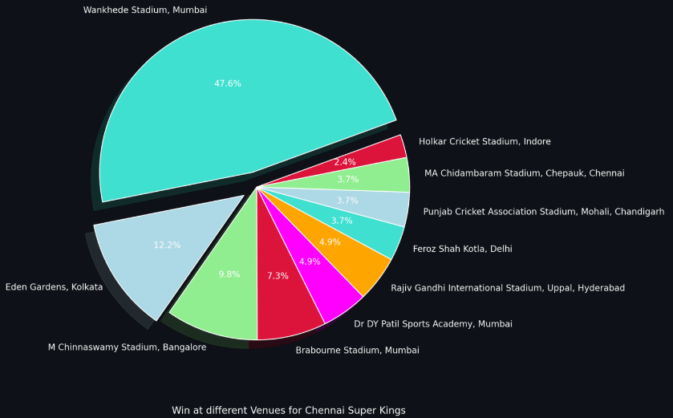
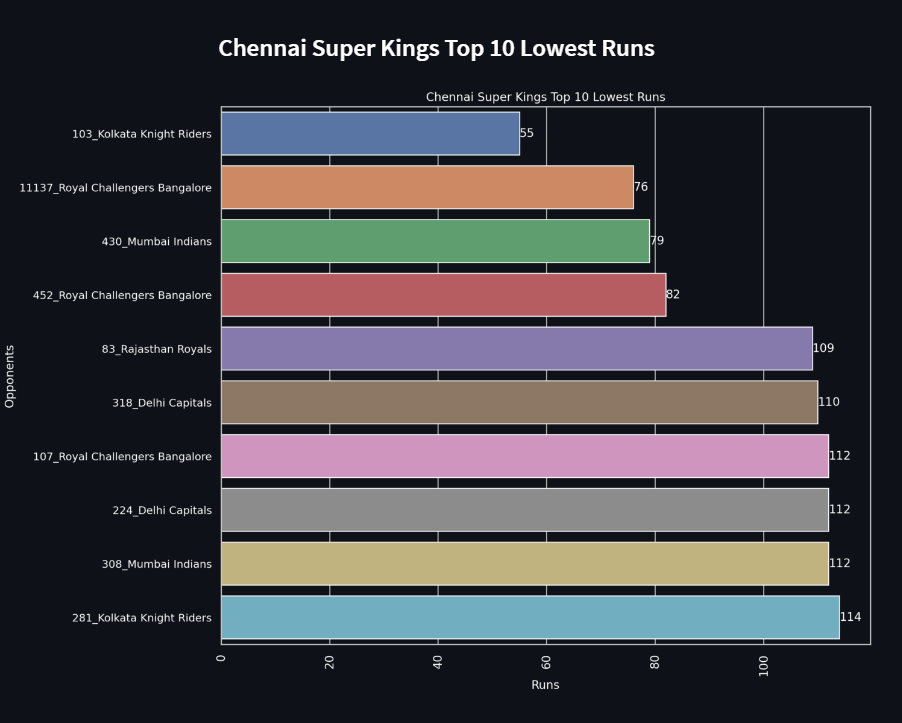

# IPL MATCH PREDICTION AND ANALYSIS
 

### Get to know about stats of your favourite team and players.

### Features
- Individual Player Analysis and Visulization
- Team Past Records Analysis and Visulization
- Neck to Neck analysis between two teams
- Batsman vs Bowler analysis
- Indepth EDA on data
- Bar charts for matches per season, player of the match, toss winners, match winners, player with most runs, wickets, etc.
- Heatmaps for average runs scored by each team at different overs
- Pie charts for representing team wins and lucky venue
- Line plots for plotting runs on different season, matches, scored by players, and many more.

[Try it Now](https://share.streamlit.io/abhayparashar31/ipl/main/main.py)

### Images

## Contributing

Contributions are always welcome!!!!

**Developed By** [@abhayparashar31](https://github.com/Abhayparashar31)
* 
